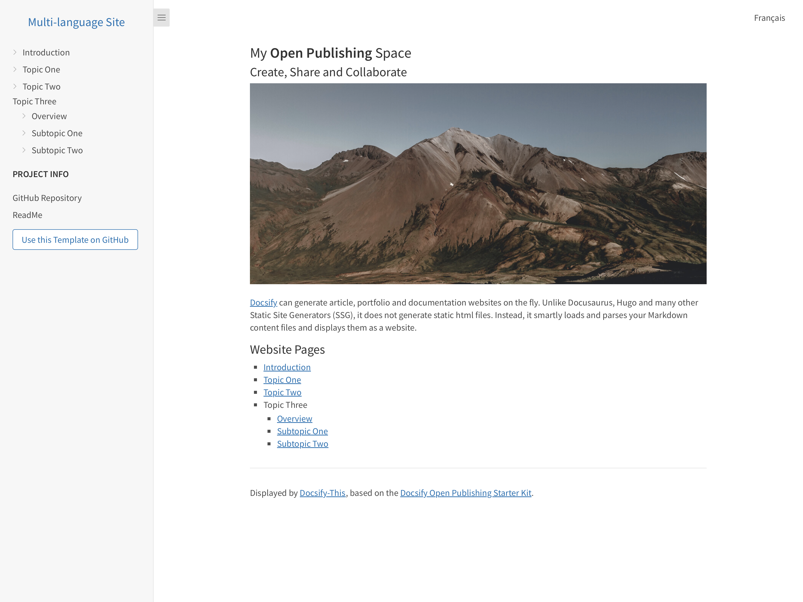

# Docsify-This Multi-language Site Template

> This is a multiple language site template for use with [Docsify-This.net](https://docsify-this.net/#/).

_Figure 1. Docsify-This Multi-language Site Template. Explore the resulting standalone web page generated by Docsify-This.net at [https://docsify-this.net/?basePath=https://raw.githubusercontent.com/hibbitts-design/docsify-this-multilanguage-site/main&homepage=home.md&sidebar=true&loadSidebar=_sidebar.md&loadNavbar=_navbar.md&name=Multi-language%20Site](https://docsify-this.net/?basePath=https://raw.githubusercontent.com/hibbitts-design/docsify-this-multilanguage-site/main&homepage=home.md&sidebar=true&loadSidebar=_sidebar.md&loadNavbar=_navbar.md&name=Multi-language%20Site)_

How to Use
---

1. Sign in to [GitHub](https://github.com), or create an account if you don’t already have one.

2. Tap **Use this template** in this repository (upper-right green button) and then choose **Create a new repository**

3. Choose the name for your new repository to contain the files and then tap **Create repository**

4. View the **home.md** Markdown file in your newly created repository and copy it's URL

5. Go to https://paulhibbitts.github.io/test-docsify-this/?advanced=true (the Docsify-This Advanced Web Page Builder) and paste the copied URL into the **Markdown File URL** field

6. Choose the Page Layout with the Docsify Sidebar

7. Scroll down the page to the **Docsify Custom Files** section and choose to display the Docsify Custom Files **Sidebar** and **Navbar**

8. Tap the **Publish as a Web Page** button to view your **home.md** Markdown file as a web page 

To add or change languages supported, each language requires the following:
* Default language Markdown files within the `docs` folder 
* Each possible language supported has a subfolder within the  `docs` folder
* If an `images` folder is used, then for each language supported the same (localized) images need to be present
* The Docsify custom sidebar and navbar for each language need to be updated to point to the appropriate Markdown files for that language 

To edit a file in GitHub, tap the **Pencil icon** (Edit this file) in the upper-right when viewing the file, make your changes, and then tap the **Commit changes...** button to save those changes.  

Docsify-This Examples
---

[Docsify-This Multi-language Site Template](https://github.com/hibbitts-design/docsify-this-multilanguage-site), displayed by Docsify-This as a:
* [Standalone Site with Docsify Sidebar and Navbar](https://docsify-this.net/?basePath=https://raw.githubusercontent.com/paulhibbitts/docsify-this-multilanguage-site/main&homepage=home.md&sidebar=true&loadSidebar=_sidebar.md&loadNavbar=_navbar.md&name=Multi-language%20Site)
* [Standalone Site with Docsify Sidebar, Navbar and Footer](https://docsify-this.net/?basePath=https://raw.githubusercontent.com/paulhibbitts/docsify-this-multilanguage-site/main&homepage=home.md&sidebar=true&loadSidebar=_sidebar.md&loadNavbar=_navbar.md&loadFooter=_footer.md&hide-credits=true&name=Multi-language%20Site)  
